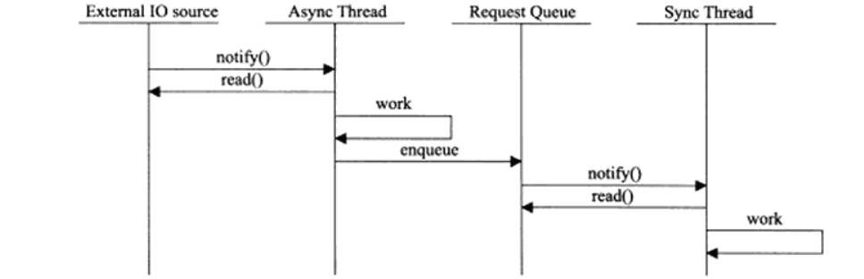
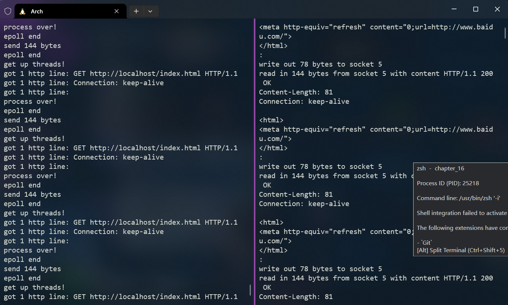

# Linux-High-Performance-Server-sample-program

摘录下《Linux高性能服务器编程》每章部分代码清单中的代码，所有代码在本地arch linux环境下已通过cmake编译并完美按照书上所述实现了服务器或客户端的功能
> 代码已按章节和C/S分类

## HTTP_Server
最终http服务器已经部署在chapter_15文件夹中， 该服务器使用Reactor事件处理模式以及**半同步半异步线程池**来实现并发, 图例如下：

- **main.cc**  ：主线程，负责处理客户连接以及IO读写  
  - 使用epoll_wait异步管理监听和连接socket并在其上注册读就绪事件，当客户连接到来时分配给一个连接socket，当客户请求到来时将其交给线程池处理，当服务器相应数据处理完毕时，将其写回给客户连接
- **http_conn.cc/.h** : http请求处理单元，使用http协议负责实际的客户数据处理
  - 通过process接口与线程池进行通信
  - 暂时只支持GET请求
- **threadpool.h** : 线程池
  - 使用工作队列来实现主线程与线程池的通信，并通过信号量与互斥锁来保持线程池中各线程的同步
  - 主线程只需要通知线程池事件发生需要处理，而不需要选取实际的线程，线程池中的各线程通过竞争来取得任务并执行
- **stress_test.cc**: 压力测试
  - 通过创建num个用户不断向服务器发送请求来测试服务器在高压状态下的稳定性，压力测试有IO复方式，多进程、多线程并发编程方式，以及几类的结合，单纯的IO复用的施压程度是最高的，因为线程和进程的调度也会占用CPU时间
- 服务器根目录设置在/var/www/html下
## HTTP服务器与压力测试程序的使用  

编译chapter_15下的和http_server有关的源文件和头文件，生成类似于wbserver的可执行文件，服务器运行需要两个参数，按顺序为IP地址，端口号，执行命令如：
`./wbserver 192.168.1.*** 12345`

压力测试程序需要三个参数，除了目标IP和端口号外，还需要向服务器发起的连接数num，执行命令如：
`./stress_test 192.168.1.*** 12345 1000`

本地arch linux环境测试结果如下：

左侧为服务器的输出，右侧为压测的输出
